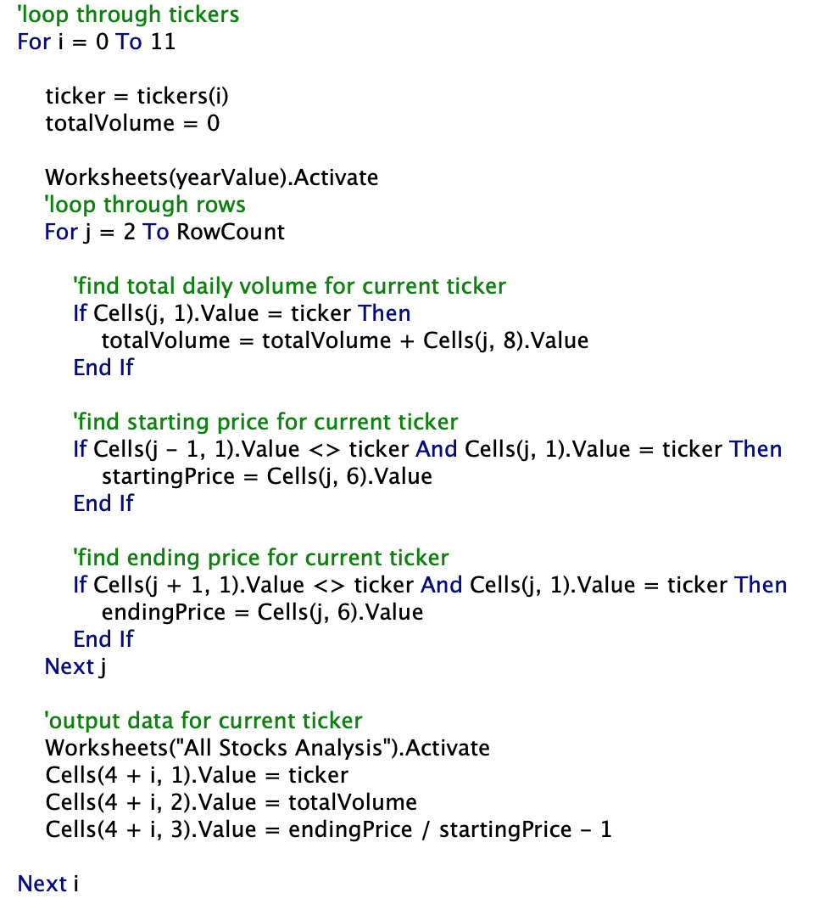
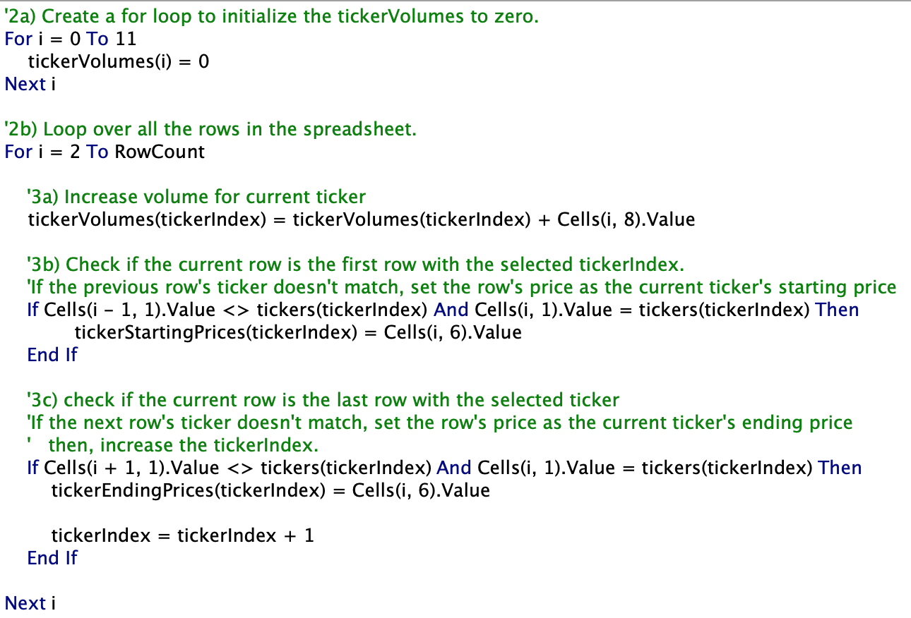

# Stock Analysis with VBA

## Overview of Project

This analysis intended to efficiently analyze large amounts of stock data using VBA. Code previously written to analyze only a few thousand trading entries from a dozen stocks was written to make the code more able to quickly analyze any amount of stocks. The time the original code took to run was then commpared to that of the refactored code in order to determine the effectiveness of rafactoring.

## Results

The original code used two loops: an outer loop iterated through each stock ticker while an inner loop iterated through each row of the data and gathered information relevant to the current stock ticker.

When run on stock data from 2017 and 2018, the original code took about 0.7-0.8 seconds to complete.

The refactored code, in contrast, used arrays to store relevant data for *every ticker* during a single loop of the data.

Instead of going through the data set for each ticker and having to output the results before doing a new loop, the refactored code stores the relevant data in three arrays, with any particular stock's data stored at the same index in each array. The change dramatically reduced runtime to just under 0.15 seconds.

## Summary

### Advantages and Disadvantages of Refactoring Code

Refactoring code carries the obvious advantage of making code more efficient, which can be extremely useful when working with expansive data sets where the shortcomings of slower code can be amplified. Efficient code can also be beneficial when the amount of available memory to work with is small. Finally, code that is refactored can become easier to read, which makes it easier for collaborators to understand and makes maintainence easier.

Disadvantages of refactoring code include the additional time needed to do so. Restructuring some sections of code may also require the restructuring of other sections in order to maintain functionality if the initial changes are substantial, i.e. the time investment of refactoring could become greater than initially anticipated. And for smaller scale projects, the efficiency gained via refactoring may be relatively negligible.

Regarding this particular project, refactoring has the potential to be extremely beneficial. In the comparison above, runtime dropped by 82% for 2017 data (.141 / 0.801 - 1 = -0.824) and by 81% for 2018 data (0.137 / 0.738 - 1 = -0.814). While the given data set is small, and an absolute difference of roughly 0.6 seconds between the runtimes is more or less negligible for the purposes of a smaller scale analysis, the refactored code will be perform far better as the scope of the project expands. Furthermore, the changes made during refactoring were easy to implement and they have provided a useful design pattern for future projects.
